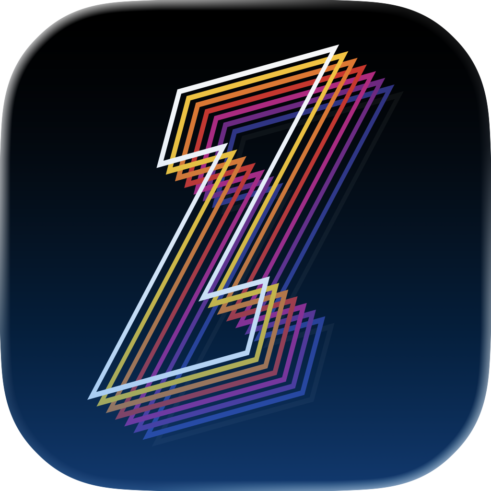

<div align="center">
  
  <h1>Zapp</h1>
  <h3>Desktop and mobile apps. 445 KB on macOS.</h3>
  <p>
    
    
    
    
    
  </p>
</div>

---

Zapp is an application framework that produces **extraordinarily small binaries** by compiling to native code (Nim by default; [Zen-C](https://github.com/zenc-lang/zenc) available as `ZAPP_NATIVE_LANG=zc`) and rendering UI in the system WebView. No bundled browser. No runtime overhead. Your frontend is your choice — React, Svelte, Vue, Solid, or vanilla; `zapp init -t <template>` scaffolds any of them.

The next native core is being written from scratch in [Z](https://github.com/popaprozac/z) and is
available as an explicitly experimental `ZAPP_NATIVE_LANG=z` build track. The
current Phase 0 path builds a pinned Z static library, validates its embedding
runtime, and exercises the framework message boundary; it is not a usable
WebView application yet. See the [rewrite charter](docs/z-rewrite-charter.md)
and [checkpoint guide](docs/z-native-core.md).

The same Zapp codebase ships to **macOS and iOS** today (Windows next). Desktop apps get the full multi-window / menu-bar / tray surface; iOS apps get UIKit-native modal sheets, file pickers, notifications, and clipboard — without any "this looks like a web app on a phone" feel.

Building with an AI agent? Point it at [`llms.txt`](llms.txt) for a
comprehensive single-file reference covering concepts, config shapes, the
full runtime API, and common patterns. See [`docs/`](docs/) for longer-form
guides.

## Benchmarks

Real numbers. Same kitchen-sink app (1 window, 1 service call) on each framework. macOS ARM64, M4 Max.

| | Zapp (zjs) | Tauri v2 | Wails v3 | Electron | Electrobun |
|---|---|---|---|---|---|
| **Binary** | **445 KB** | 8.0 MB | 7.5 MB | 170.6 MB | 17.0 MB |
| **Bundle** | **2.8 MB** | 8.1 MB | 9.0 MB | 263.3 MB | 17.1 MB |
| **Memory** | **26 MB** | 26 MB | 32 MB | 90 MB | 101 MB |
| **Build** | **3.5s** | 53.8s | 1.9s | 3.6s | 12.8s |

### Bridge latency — by context (µs, median)

Two numbers matter, not one: calls from the webview, and calls from a
worker. Worker calls are where real app hot paths live (sync engine,
DB access, local filesystem).

| | Zapp (zjs) | Tauri | Wails | Electron | Electrobun |
|---|---:|---:|---:|---:|---:|
| **Webview → native** | 135 | 265 | 325 | **51** | 360 |
| **Worker → native** | **0.45** | N/A<sup>\*</sup> | N/A<sup>\*</sup> | 73 | N/A<sup>†</sup> |

<sub>\* Tauri and Wails don't ship a JS worker with native-call access — their equivalent is "drop to Rust/Go and wire it yourself." No apples-to-apples JS number exists.</sub>
<br>
<sub><sup>†</sup> Electrobun uses an encrypted WebSocket for webview IPC; no separate worker→native fast path.</sub>

Electron wins row 1 because Chromium's IPC uses optimized named pipes / mach ports. Electron's worker row (73 µs) is the realistic pattern: a Web Worker can't call `ipcRenderer` directly (contextBridge only exposes APIs to the main window), so calls route worker → renderer postMessage → `ipcRenderer.invoke` → main, then the reply flows back the same way — 2 postMessage hops plus the IPC round-trip.

Zapp workers bypass that entirely — `Services.invokeSync` is a direct C call via the worker engine's host object. **zjs is 162× faster than Electron** on this path. For apps where hot work lives in workers (sync engines, DB access, background pipelines), row 2 is the number that matters — and Tauri/Wails can't compete on row 2 at all, because they force a language boundary instead.

### Which engine?

Worker engine is **per-worker**, set in `zapp.config.ts → headless.<id>.engine`. The framework dispatches at runtime; you can mix engines within one app. Six engines ship today:

- **`zjs`** *(default, recommended)* — Zapp's first-party engine. ~1 MB engine cost, cross-platform, iOS-friendly (no JIT entitlement gymnastics). Direct value-marshalling host bridge at 0.45 µs. Bytecode AOT option (`bytecode: true`) ships parse-free workers.
- **`bare-jsc`** — JIT via the system JSC framework on macOS. Zero engine bundle cost — literally smaller than zjs on Apple. Pick when absolute KB and macOS-only JIT-perf matter.
- **`bare-v8`** — JIT on Windows / Linux where there's no system JSC. ~30 MB bundle increase. JIT-heavy workloads only.
- `bare-quickjs`, `bare-mqjs`, `bare-hermes` — niche / size-constrained variants. zjs is usually the better fit.

```ts
// zapp.config.ts — mix engines per worker
headless: {
  sync:    { script: "src/workers/sync.ts",    engine: "zjs" },
  encoder: { script: "src/workers/encoder.ts", engine: "bare-jsc" },  // JIT-heavy
}
```

<sub>Full taxonomy + platform tradeoffs in <a href="docs/engines.md">docs/engines.md</a>. Latest worker→native µs across engines in <a href="benchmarks/apps/zapp-host-bridge/RESULTS.md">benchmarks/apps/zapp-host-bridge/RESULTS.md</a>.</sub>

## Quick Start

```bash
# Prerequisites: Nim + Bun (macOS/Linux/iOS). Windows builds use ZAPP_NATIVE_LANG=zc (Nim-Windows in progress).
bunx @zappdev/cli init my-app
cd my-app
bun install
bun run dev
```

Production build:
```bash
bun run build
bun run package   # .app bundle with icon (macOS)
```

No global install needed — `bunx` fetches the CLI on the fly for init, and `bun run` uses the local copy in your project's `node_modules`.

iOS dev mode (requires Xcode + booted Simulator):
```bash
xcrun simctl boot "iPhone 17 Pro"   # or any device from `simctl list devices available`
bun run dev --platform ios
```
Vite + your app on the sim, with stdout/stderr streamed to the dev terminal — same loop as desktop dev, just routed through `simctl launch --console-pty`. Edit a `.ts` file → Vite HMR refreshes the webview; edit a `.zc` / `.m` file → re-run `bun run dev --platform ios` to recompile + reinstall.

iOS prod build:
```bash
bun run build --platform ios
xcrun simctl install booted bin/ios/<name>.app
xcrun simctl launch --console-pty booted com.your.bundle
```
First iOS build takes a minute (cross-compiles bare-* engines for the iOS Simulator SDK if your config opts into them). Subsequent builds reuse the cached static libs.

### Custom icons and Info.plist

Drop your app icon into `build/macos/`:

```
build/macos/icon.icon       # Icon Composer (best for macOS 26+ liquid glass)
build/macos/icon.icns       # traditional .icns
build/macos/icon.iconset    # source set, CLI converts via iconutil
build/macos/icon.png        # 1024×1024, CLI compiles via actool
```

Customize `Info.plist` via typed config (autocomplete-friendly):

```ts
// zapp.config.ts
macos: {
  copyright: "Copyright © 2026 You",
  usageDescriptions: { camera: "We need camera for ...", microphone: "..." },
  plistExtras: { LSUIElement: false, MyKey: "MyValue" },
}
```

For nested dicts/arrays, drop a partial XML file into `build/macos/Info.plist.extra`. Full pattern in [`docs/patterns.md`](docs/patterns.md#custom-icon-and-infoplist).

## Features

- **Window Management** — Create, resize, fullscreen, always-on-top. 11 typed events with payloads.
- **Native Sidebars** — `Window.create({ sidebar: { url } })` renders a real `NSSplitViewItem` sidebar: the actual system material (liquid glass on macOS 26), full-height under the titlebar, system collapse animation — with your web content inside it. No other web-shell framework can do this.
- **Application Menus** — Default OS menus + custom menu API with roles, accelerators, inline actions, and optional item icons (SF Symbols, file paths, or data URLs).
- **Context Menus** — Filtered default (no Reload/Back) + `ContextMenu.show()` for custom native menus.
- **Dialogs** — Native file open/save and message dialogs.
- **Draggable Regions** — `data-zapp-drag-region` for custom titlebar apps. Buttons, inputs, links, and other interactive elements inside a drag region stay clickable by default; override with `style="--zapp-drag: drag"` or `--zapp-drag: no-drag` to force either behavior. Native window metrics (`--zapp-titlebar-height`, `--zapp-content-inset-left`) are injected as CSS variables so custom titlebars size correctly without hard-coded magic numbers.
- **Close Prevention** — Cancellable close events from native or JS. "Unsaved changes?" dialogs.
- **Services** — Define native RPC in Zen-C, call from JS. Auto-generated TypeScript bindings. Drop `.m` (macOS) or `.c` (Windows) files anywhere under `zapp/` for ObjC/C-backed services (Keychain, AVFoundation, libsqlite3, etc.) — auto-compiled and linked.
- **Workers (unified)** — Webview-spawned (`new Worker("./foo.ts")`) or headless (declared in `zapp.config.ts`). Both share the full runtime API — `Window.create`, `Events`, `Services`, `Notification`, `Dock`, `Sync` — via a zero-overhead direct host bridge (no IPC). Six engines available per-worker (zjs default; bare-jsc, bare-v8, bare-quickjs, bare-mqjs, bare-hermes also ship). Bytecode AOT via `bytecode: true` on zjs / bare-hermes.
- **Embedded Webviews** — `<zapp-webview src>` embeds a full native webview inside your page (macOS + iOS). Like an `<iframe>`, but it loads sites that block iframing (`X-Frame-Options` / `frame-ancestors`) and stays sandboxed — no bridge access; host↔embed talk only via `postMessage`/`execJS`.
- **Screens** — `Screen.getAll()` / `getPrimary()` / `getCursorPoint()` + `Window.getScreen()` with bounds, work area, scale factor, and a `SCREENS_CHANGED` event. Top-left global coordinates everywhere.
- **Sync** — `wait`/`notify` across contexts without SharedArrayBuffer.
- **Events** — Typed cross-context events with autocomplete.
- **Security** — Declarative permissions manifest (`permissions` in zapp.config.ts — allow/deny native capability, enforced natively), navigation allowlist, FS path allowlist, sandboxed embeds, path traversal prevention, dev tools disabled in production. See [`docs/security.md`](docs/security.md).
- **Packaging** — `.app` bundles with icon generation (including macOS Tahoe liquid glass).
- **iOS** — Same source compiles to iOS Simulator / device via `--platform ios`. UIKit-native presentation: `Window.create({ asSheetOf, presentation: "page" | "form" | "fullscreen" | "bottomSheet", detents, grabber })` for sheets and drawers, `UIDocumentPickerViewController` for file pickers, `UNUserNotificationCenter` for notifications + actions + reply field, `UIPasteboard` for full clipboard (text / HTML / image / files), `UIDropInteraction` for file drag-drop, custom `WKURLSchemeHandler` protocols, navigation allowlist with Safari handoff for external links.

## Platform support

| Feature | macOS | iOS | Windows |
|---|:-:|:-:|:-:|
| Window create / resize / events | ✅ | ✅ (single window on iPhone, sheets for "new content") | ⚠️ in progress |
| Application menus | ✅ | n/a (no menu bar) | ⚠️ |
| Tray / status item | ✅ | n/a | ⏳ |
| Modal sheets (`asSheetOf`) | ✅ NSWindow.beginSheet | ✅ presentViewController + UISheetPresentationController | ⏳ |
| Native dialogs | ✅ | ✅ UIDocumentPicker / UIAlertController | ⚠️ |
| Notifications + actions | ✅ | ✅ UNUserNotificationCenter | ⏳ |
| Clipboard (text / HTML / image / files) | ✅ | ✅ UIPasteboard | ⚠️ text only |
| File drag-drop into webview | ✅ | ✅ UIDropInteraction | ⏳ |
| Custom protocols (`asset://`, ...) | ✅ | ✅ | ⏳ |
| Embedded webviews (`<zapp-webview>`) | ✅ | ✅ | ⏳ |
| Native sidebar windows | ✅ | ⏳ UISplitViewController | ⏳ |
| Screens / displays API | ✅ | ✅ (built-in display) | ⏳ |
| Navigation allowlist | ✅ | ✅ | ⏳ |
| Workers — `zjs` (default, cross-platform) | ✅ | ✅ | ✅ |
| Workers — `bare-jsc` (macOS JIT) | ✅ (JIT) | ✅ (no JIT, Apple policy) | n/a |
| Workers — `bare-v8` (Win/Linux JIT) | n/a | n/a | ✅ |
| Workers — capability modules (`fetch` / `websocket` / `fs` / ...) | ✅ | ✅ (FFI disabled per App Store policy) | ✅ |
| Global shortcuts | ✅ | n/a (by design) | ⏳ |
| App Store / TestFlight packaging | n/a | ⏳ Phase 3 | n/a |

## Example

**Native** (`zapp/app.zc`):
```zc
import "app/app.zc";

fn greet(_app: App*, _args: JsonValue*) -> string {
    return "Hello from Zapp!";
}

fn on_ready(_id: int, _handle: void*) -> void {
    Window{id: _id, handle: _handle}.show();
}

fn run_app() -> int {
    let config = AppConfig{
        name: "My App",
        applicationShouldTerminateAfterLastWindowClosed: true,
        webContentInspectable: Zapp::inspectable_auto(),
        maxWorkers: 0,
        qjsStackSize: 0,
    };
    let app = App::new(config);
    app.service.add("greet", greet);

    let opts = WindowOptions::create("My App");
    opts.visible = false;
    let win = app.window.create(&opts);
    win.on_ready(on_ready);

    return app.run();
}
```

**Frontend** (`src/main.ts`):
```ts
import { Window, WindowEvent, Services, Menu, App } from "@zappdev/runtime";

Window.current().on(WindowEvent.READY, () => {
    Window.current().show();
});

Menu.build([
    { role: "appMenu" },
    { label: "File", submenu: [
        { label: "Quit", accelerator: "CmdOrCtrl+Q", action: () => App.quit() },
    ]},
    { label: "Edit", role: "editMenu" },
]);

const result = await Services.invoke("greet", { name: "World" });
```

## Headless workers

Add a long-running TypeScript worker that starts at app boot — useful for
database connections, background sync, or any app-level state that needs
to outlive individual windows.

```ts
// zapp.config.ts
import { defineConfig } from "@zappdev/cli/config";

export default defineConfig({
  name: "My App",
  // Capability modules — auto-installs `bare-fetch` + injects `fetch`
  // global into every bundled worker.
  workerModules: ["fetch"],
  headless: {
    sync: {
      script: "src/workers/sync.ts",
      engine: "zjs",                          // default; can also be "bare-jsc", "bare-v8", ...
      restart: { maxRetries: 3, withinMs: 60_000 },
    },
  },
});
```

```ts
// src/workers/sync.ts
import { Events, Services, Notification } from "@zappdev/runtime";

setInterval(() => {
  // Sync in a worker — direct host-object C call, no await, no microtask.
  // (In a webview context you'd use Services.invoke with await.)
  const latest = Services.invokeSync("fetchLatest");
  Events.emit("data:updated", latest);   // broadcast to every open window
}, 5000);
```

```ts
// src/main.ts — any window can listen
import { Events } from "@zappdev/runtime";
Events.on("data:updated", (data) => render(data));
```

All workers (webview-spawned via `new Worker()` or headless via config)
have identical runtime API access: `Window.create`, `Events`, `Services`,
`Notification`, `Dock`, `Sync`. The only difference is lifecycle.

## Packages

| Package | NPM | Docs |
|---|---|---|
| `@zappdev/cli` | [npm](https://www.npmjs.com/package/@zappdev/cli) | [README](cli/README.md) |
| `@zappdev/runtime` | [npm](https://www.npmjs.com/package/@zappdev/runtime) | [README](runtime/README.md) |
| `@zappdev/vite` | [npm](https://www.npmjs.com/package/@zappdev/vite) | [README](vite/README.md) |

## Documentation

| | |
|---|---|
| [`llms.txt`](llms.txt) | Single-file reference — concepts, config, full runtime API, patterns, anti-patterns. Good for agents. |
| [`docs/api-reference.md`](docs/api-reference.md) | Long-form API reference with edge cases |
| [`docs/engines.md`](docs/engines.md) | Worker engine taxonomy + per-platform recommendations |
| [`docs/zen-c-services.md`](docs/zen-c-services.md) | Writing native services: JsonValue args, lifecycle, thread-safety |
| [`docs/patterns.md`](docs/patterns.md) | Cookbook of common app patterns |
| [`docs/architecture.md`](docs/architecture.md) | How the pieces fit under the hood |
| [`docs/auto-update-decision.md`](docs/auto-update-decision.md) | Auto-update path decision (Tauri-style; implementation paused) |
| [`benchmarks/README.md`](benchmarks/README.md) | Methodology for the benchmarks above |
| [`benchmarks/RESULTS.md`](benchmarks/RESULTS.md) | Full measurements with raw JSON |

## License

MIT
